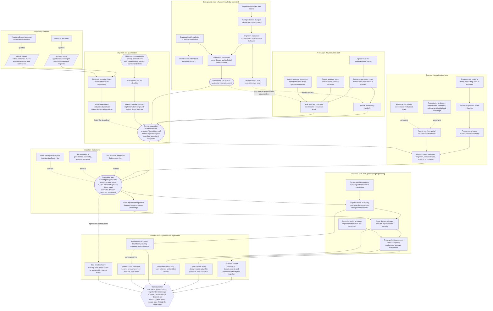

# From Gatekeepers to Plumbers? — argument map

This document maps the claims and reasoning of the essay independently from its prose. It distinguishes established premises, the essay's central proposition, supporting evidence, objections, consequences, and unresolved questions.

## Argument in compact form

1. Organizational knowledge was already collective and fragmented.
2. Scarce implementation skill made engineering the default route into production.
3. That route distorted knowledge, but also forced some knowledge boundaries to be crossed.
4. Agents may automate implementation and decentralize production without triggering the same boundary-spanning.
5. The result may be an integration gap: relevant knowledge exists but does not meet the change in time.
6. Conventional guardrails enforce known constraints; they do not discover uncodified dependencies.
7. The proposed “plumbing” must therefore route consequential changes toward relevant knowledge and authority while preserving local autonomy.
8. Whether an organization can build that plumbing without recreating the engineering bottleneck remains unresolved.
