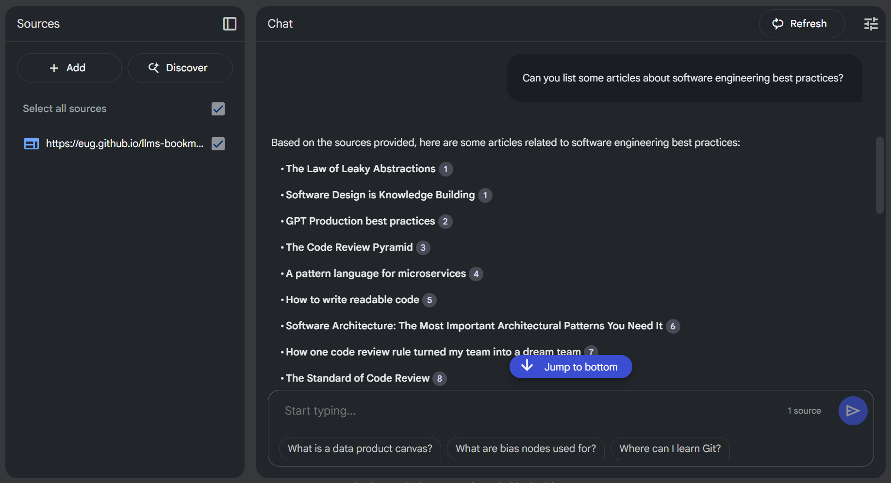
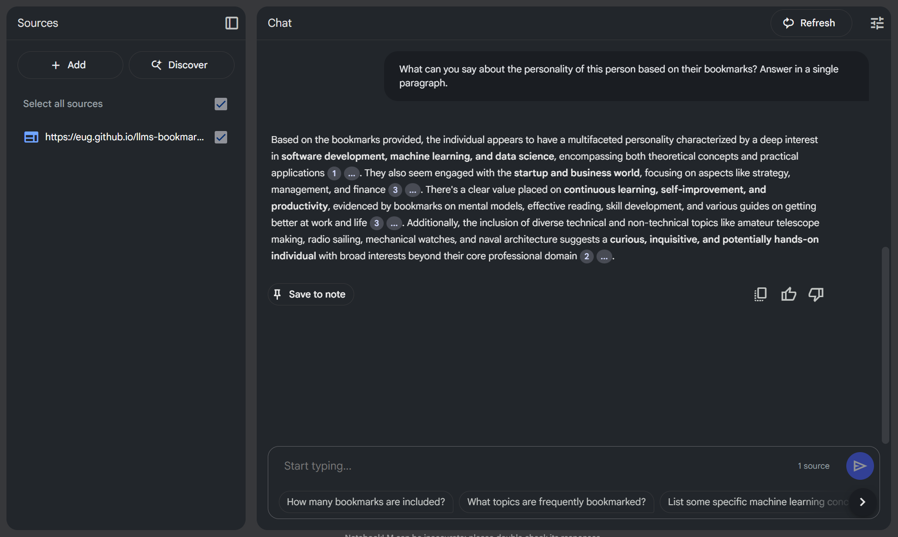

The `llms.txt` proposal ([llmstxt.org](https://llmstxt.org/index.md)) presents a fascinating idea for providing LLM-friendly content, primarily showcased with documentation for projects like FastHTML. It offers a structured avenue for models to access concise, expert-level information.

But what if we explored taking this concept a step further? Could this approach, initially designed for docs, be adapted and extended for the rich, diverse content found on blogs?

## Exploring the Idea: `llms.txt` for Bloggers

Imagine a scenario where your blog isn't just human-readable, but also intentionally LLM-optimized. By potentially extending the `llms.txt` concept, we could explore creating a manifest that points LLMs to the full text of our posts, curated bookmarks, and other relevant metadata.

I've started experimenting with this concept on my own blog. Here's what my site currently generates:
*   A main [llms.txt](https://eug.github.io/llms.txt) with blog metadata, about section, and pointers.
*   [llms-posts-full.txt](https://eug.github.io/llms-posts-full.txt): All blog posts in raw Markdown, concatenated.
*   [llms-bookmarks-full.txt](https://eug.github.io/llms-bookmarks-full.txt): All shared bookmarks in Markdown.

This early experiment aims to provide a richer, structured dataset for LLMs to potentially work with, right from the source.

## A Key Consideration: Licensing and Data Use

Before diving into potential use cases, it feels crucial to consider the digital handshake we might be making when publishing an `llms.txt` file for our blogs. If we provide this structured, LLM-friendly access to our content, are we, in essence, signaling an intent? It seems plausible that this could be interpreted as granting permission for the data to be used in ways that LLMs excel at – which might include, but isn't necessarily limited to:

*   **Training and Fine-tuning:** Could your content become part of the vast datasets used to train future models or fine-tune existing ones on specific styles or topics (like your blog's niche)?
*   **Remixing and Derivative Works:** Might LLMs use your content as a basis for generating new text, summaries, or even entirely new creative works derived from or inspired by your posts?
*   **Indexing and Analysis:** Beyond simple search, could your content be deeply indexed, analyzed for patterns, and cross-referenced in new ways?

This isn't about suggesting a renounce of copyright wholesale, but rather acknowledging that the act of making blog content explicitly available and optimized for machine consumption could carry an implicit consent for these kinds of transformative uses. Is it a *quid pro quo*: we give models better data, and in return, those models can do more interesting things with it, potentially amplifying our blog's reach and impact in new ways? If one isn't comfortable with their content being used this way, then perhaps providing an `llms.txt` wouldn't be the right step.

For those of us who see this as an exciting frontier to explore, it could be a way to actively participate in how AI understands and interacts with the wealth of knowledge and creativity shared on personal blogs.

## From SEO to AEO with `llms.txt`?

The digital landscape appears to be in a period of significant flux. For years, Search Engine Optimization (SEO) was a central focus, emphasizing keywords and rankings to gain visibility on Search Engine Results Pages (SERPs). However, as highlighted by emerging concepts like Answer Engine Optimization (AEO) (see [SurferSEO's article on AEO](https://surferseo.com/blog/answer-engine-optimization/)), the game seems to be evolving. Users, increasingly interacting with AI assistants and sophisticated search tools, now often expect direct answers and conversational results, not just a list of links.

Answer Engines, powered by advanced AI and Natural Language Processing, aim to understand user *intent* and provide precise, concise answers. This is where the idea of `llms.txt` for blogs could become particularly relevant.

*   **Direct Value Delivery:** AEO emphasizes providing answers upfront. Could an `llms.txt` file, by its very structure, be a way to give LLMs a direct, no-nonsense summary and pathway to a blog's core content? It's like potentially handing the answer engine the keys to your knowledge base.
*   **Structured for Understanding:** AEO seems to thrive on well-structured content. Schema markup and clear formatting help answer engines interpret and display information effectively. Does the proposed `llms.txt` format, with its defined sections and Markdown structure, offer a similar level of clarity specifically tailored for LLM consumption?
*   **Aligning with Modern Search Behaviors:** Users are asking questions in natural language, often through voice search or AI chatbots. Traditional SEO isn't always optimized for this. Could an `llms.txt` help bridge this gap by making a blog's content more readily digestible and understandable for the AI systems that power these new interfaces?
*   **Building Authority in an Age of Answers?:** AEO appears to be about establishing content as an authoritative source that provides clear, direct answers. By curating what an LLM sees first through `llms.txt`, could bloggers better position their expertise and ensure their core messages are more easily found and understood by these new information gatekeepers?

In essence, exploring the adoption of `llms.txt` for blogs might not just be about feeding data to a model; it could be a strategic move to align with the principles of AEO. It's potentially about future-proofing content and ensuring it remains visible and valuable as search paradigms evolve from keyword matching to intent fulfillment and direct answer provisioning.

## Potential Use Cases for an LLM-Optimized Blog:

What could an LLM-optimized blog unlock? Here are a few possibilities:

1.  **Smarter Q&A:**
    *   Could users (or the LLM itself) ask complex questions spanning multiple posts? E.g., "What are the common themes in posts tagged 'AI' from the last year?"
    *   Might we get answers based *only* on the blog's content, potentially reducing hallucinations?

2.  **Content Generation & Augmentation Ideas:**
    *   Could it help draft a new blog post in the style of a 'Python Tips' series, focusing on asynchronous programming?
    *   Might it suggest alternative titles for a draft post?
    *   Could it generate a summary of a 'Project X Retrospective' series?

3.  **Enhanced Search & Discovery Possibilities:**
    *   Could one perform semantic searches across all articles and even curated bookmarks? E.g., "Find articles discussing 'serverless architectures' and any related bookmarks saved."
    *   Could an LLM assist in auto-tagging posts or suggesting related articles with much higher accuracy?

4.  **Personalized Experiences (Further Down the Line?):**
    *   Imagine an LLM-powered agent that has processed an entire blog. Could it offer personalized summaries or learning paths based on a user's query and the blog's content?

5.  **Data Portability & Analysis Opportunities:**
    *   Could one more easily feed an entire body of work into different LLM tools or local models for analysis, without complex scraping?

Ultimately, these are just a few initial thoughts. The core idea is that by making our blog content more accessible and understandable to LLMs, we could unlock entirely new ways for readers (and ourselves) to interact with, synthesize, and draw connections across our accumulated knowledge. Imagine an experience where insights from multiple related posts are seamlessly integrated together in response to a query, creating a much richer and more dynamic form of content consumption than simply reading individual articles in isolation. The potential to transform blog reading into a more interactive, interconnected journey seems quite exciting.

## A Practical Dive: Unlocking Bookmark Insights with NotebookLM

I've been experimenting with ways to make my bookmarks more accessible to the general public, moving away from private silos – a journey I detailed in my post "[My bookmarks are public now](my-bookmarks-are-public-now.md)". Part of this exploration involves not just making them public, but also easier to query and gain insights from, even in their raw, unstructured form. We all have bookmarks, right? Traditionally, making them useful meant meticulous tagging, and revisiting them. But what if we could just... not, or at least, less so?

I've been playing around with feeding my blog's `llms-bookmarks-full.txt` into tools like Google's NotebookLM.

Going a step further, as shown in the second image, one might even explore more abstract queries. For instance, posing a question like, "What can you say about the personality of this person based on their bookmarks?" yielded a response that was, it's worth noting, quite accurate given the nature of the saved links. This hints at the potential for LLMs to draw higher-level inferences from curated data, moving beyond simple information retrieval into areas that feel more akin to understanding an individual's interests and perhaps even their thought patterns, all derived from their digital trail.

If you're curious to try it yourself, you can chat directly with my bookmarks by visiting [Google NotebookLM](https://notebooklm.google.com/notebook/65911a6f-ce1b-4604-bb7d-178aa88f67ea?original_referer=https%3A%2F%2Fwww.google.com%23&pli=1).

## Wrap up

So, what if we started thinking more intentionally about how our blogs feed into these rapidly evolving language models? The experiment with NotebookLM, simply by pointing it at a raw list of bookmarks, offers a small taste of the potential. Imagine the richer interactions and deeper insights we could unlock if we consciously provided LLMs with access to our full posts and curated links in a more structured, yet still easily manageable way.

Whether or not foundational model companies decide to prioritize direct ingestion of such `llms.txt` files (or similar conventions) remains to be seen. However, the value for individual creators and their audiences in making content more AI-accessible might be a compelling enough reason to explore these paths. It empowers us to leverage a growing ecosystem of AI tools with our own curated knowledge bases, on our own terms.

This isn't about a rigid specification, but rather an open invitation to explore. How might we, content creators, make our digital footprints more readily useful for these new forms of AI-driven discovery and synthesis? What other simple experiments could we run? What are your thoughts on extending concepts like `llms.txt` to the world of blogging, or other creative approaches to bridge our content with AI?
